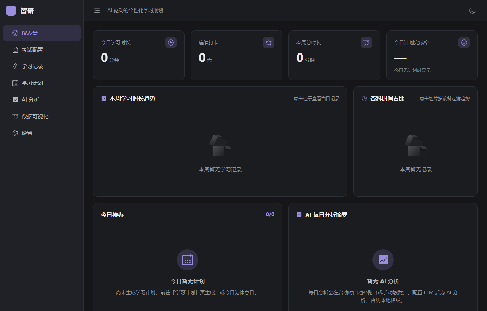
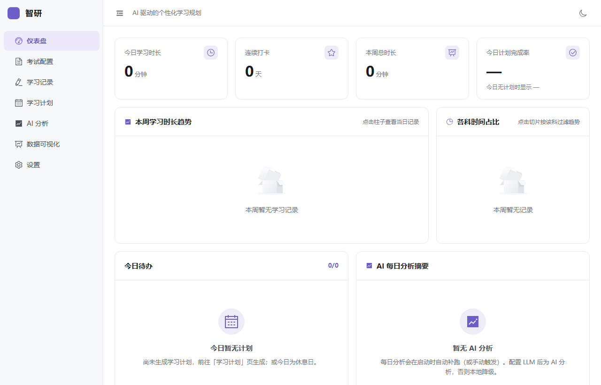
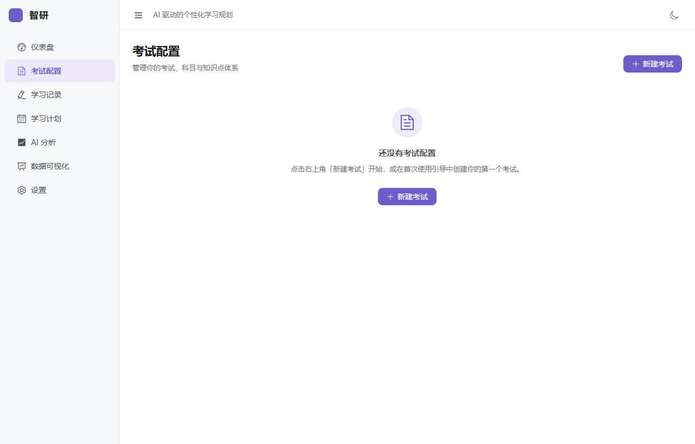
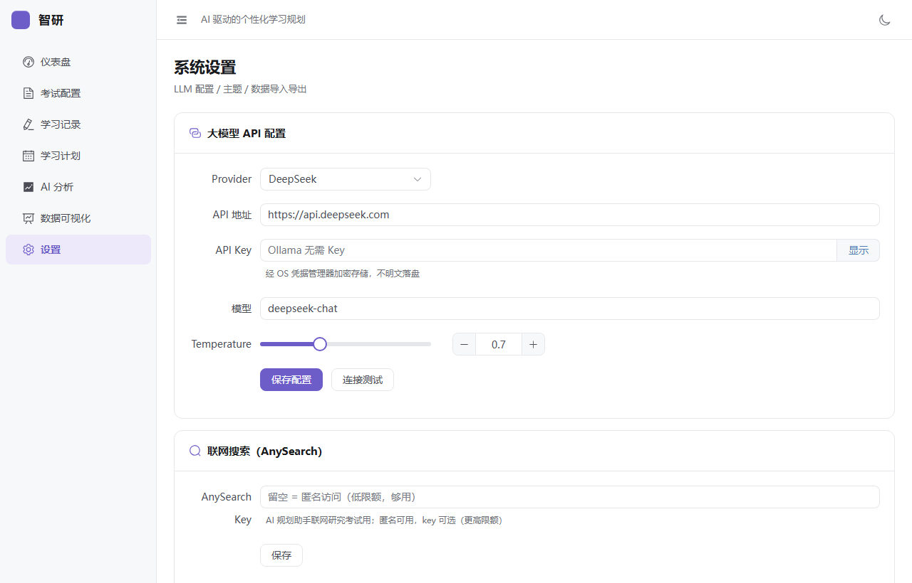
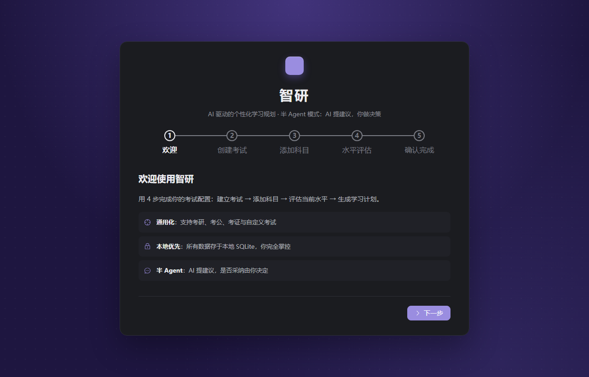
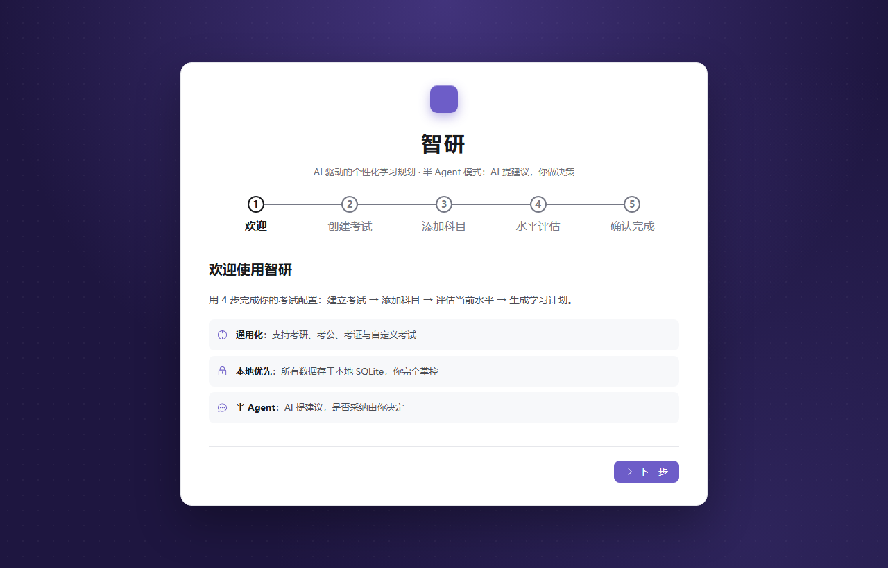

<p align="center">
  
</p>

<h1 align="center">智研（ZhiYan）</h1>

<p align="center">
  <strong>AI 驱动的个性化学习规划桌面应用</strong><br />
  半 Agent 模式 —— AI 提建议，人做决策
</p>

<p align="center">
  <a href="./LICENSE"></a>
  <a href="https://github.com/nicepkg/zhiyan/actions"></a>
  
  
</p>

---

## ✨ 为什么选择智研？

市面上的 AI 学习工具往往让 AI 直接替你做决定——生成一份"完美计划"然后让你照做。**智研的理念不同**：

> **AI 是你的学习顾问，不是你的老板。**

智研采用**半 Agent 模式**：AI 负责分析数据、提出建议、联网研究，但每一步都需要你的确认才会执行。你始终掌握最终决策权。没有配置 LLM？所有核心功能都有本地算法降级，开箱即用。

## 📸 界面预览

| 仪表盘（暗色） | 仪表盘（亮色） |
|:---:|:---:|
|  |  |

| 考试配置 | 系统设置 |
|:---:|:---:|
|  |  |

| 引导页（暗色） | 引导页（亮色） |
|:---:|:---:|
|  |  |

## 🎯 核心功能

### 📋 通用化考试配置

支持**考研、考公、考证、自定义考试**四种类型。每个考试可配置多个科目，每个科目支持树形知识点结构（章节 → 小节 → 知识点），并为每个知识点设定掌握度评级（1-5 星）。

### 📅 学习计划 — 四视图 + AI 生成

- **AI 生成**：配置 LLM 后，AI 规划助手可联网研究考试大纲和备考策略，与你讨论后生成个性化学习计划
- **本地降级**：未配置 LLM 时，内置算法根据科目权重、知识点掌握度自动分配时间
- **四种视图**：
  - 📆 **日历视图** — 月历概览，一眼看全
  - 📊 **甘特图** — 时间轴展示阶段规划
  - 📝 **列表视图** — 逐任务管理，支持拖拽排序
  - 📈 **计划 vs 实际对比** — 可视化执行偏差
- 甘特图和列表视图均支持**拖拽排序**

### 📝 学习记录 + 错题联动

- **快速记录**：选科目 → 选知识点 → 填时长/做题数/正确数/掌握度/心情/时段 → 一键保存
- **错题自动联动**：做题数 > 正确数时自动弹出错题录入区（题目/答案/错因分析）
- **跨天 04:00 归一化**：凌晨 00:00-03:59 的学习自动归属前一天（考研党的作息）
- **日历打卡**：日历上用绿点标记有学习记录的天
- **错题管理**：筛选、标记已掌握、复习计数

### 📊 数据可视化 — 6 种图表

| 图表 | 说明 |
|------|------|
| 时长趋势折线图 | 每日/每周学习时长变化 |
| 各科占比饼图 | 时间分配是否合理 |
| 正确率曲线 | 做题能力变化趋势 |
| 进度雷达图 | 各科目/知识点掌握度一览 |
| 知识点热力图 | 哪些知识点是薄弱环节 |
| 分数预测仪表 | AI 基于历史数据预测考试成绩 |

所有图表支持**时间范围筛选**、**科目筛选**、**导出 PNG**。

### 🤖 AI 分析 — 半 Agent 模式

- **每日分析**：总结当天学习情况，指出薄弱环节
- **每周分析**：对比上周数据，发现趋势变化
- **阶段分析**：评估整体备考进度，预测分数区间
- **建议需确认**：AI 提出的每条建议都以卡片形式展示，用户逐条确认/拒绝后才会应用到系统
- **本地降级**：未配置 LLM 时，降级为基于统计规则的本地分析（标注"本地分析（非 AI）"）

### 🔒 数据导入导出 + 备份恢复

- **JSON 导出**：支持全部/指定考试/日期范围，分批处理 + schema 校验
- **JSON 导入**：三种冲突处理模式（跳过/覆盖/合并）
- **数据库备份**：`VACUUM INTO` 一致性快照，输出 `.db` 文件
- **数据库恢复**：覆盖 + 自动重启

## 🛠 技术栈

| 层 | 技术 | 说明 |
|----|------|------|
| 桌面框架 | [Tauri 2.0](https://tauri.app/) | Rust 后端，轻量安全 |
| 前端框架 | [Vue 3](https://vuejs.org/) + TypeScript | Composition API + `<script setup>` |
| UI 组件库 | [Element Plus](https://element-plus.org/) | + [Tailwind CSS v4](https://tailwindcss.com/) |
| 状态管理 | [Pinia](https://pinia.vuejs.org/) | + vue-router |
| 图表 | [ECharts 5](https://echarts.apache.org/) | via vue-echarts |
| 数据库 | SQLite | via `@tauri-apps/plugin-sql` |
| HTTP | `@tauri-apps/plugin-http` | Rust 侧发起，绕前端 CSP |
| 安全存储 | [keyring](https://crates.io/crates/keyring) | OS 凭据管理器（DPAPI 加密 API Key） |
| 构建工具 | [Vite 6](https://vite.dev/) | |
| 测试 | [Vitest](https://vitest.dev/) | 单元测试 |

### 架构概览

```
┌─────────────────────────────────────────────────────┐
│  Frontend (Vue 3 + TypeScript)                      │
│  ┌─────────┐  ┌──────────┐  ┌───────────────────┐  │
│  │  Pages   │→│  Stores   │→│  Services          │  │
│  │  (.vue)  │  │  (Pinia)  │  │  (llm/search/db) │  │
│  └─────────┘  └──────────┘  └────────┬──────────┘  │
│                                       │ invoke()    │
├───────────────────────────────────────┼─────────────┤
│  Backend (Rust)                       │             │
│  ┌────────────┐  ┌──────────────────┐│             │
│  │ credentials │  │ tauri-plugin-sql ││             │
│  │ (keyring)   │  │ (SQLite)         ││             │
│  └────────────┘  └──────────────────┘│             │
│  ┌────────────────────────────────────┘             │
│  │ tauri-plugin-http → LLM API / AnySearch API      │
│  └──────────────────────────────────────────────────│
└─────────────────────────────────────────────────────┘
```

**数据流**：Vue 页面 → Pinia stores → Services 层 → `invoke()` 调 Rust 后端 → SQLite 读写 / keyring 存取 / HTTP 调 LLM

## 📋 环境要求

### Windows（主要支持平台）

- **Node.js** ≥ 18
- **Rust** 工具链（`stable-x86_64-pc-windows-msvc`）
  - 安装：[rustup](https://rustup.rs/)
- **Microsoft Visual Studio C++ Build Tools**
  - 安装 Visual Studio Build Tools 时勾选"使用 C++ 的桌面开发"
- **Windows SDK**（通常随 Build Tools 一起安装）
- **WebView2 Runtime**（Windows 11 自带；Windows 10 可能需要手动安装）

### macOS / Linux

Tauri 2.0 原生支持 macOS 和 Linux，但本项目目前仅在 Windows 上测试。macOS/Linux 用户如果遇到构建问题，请参考 [Tauri 官方文档](https://tauri.app/start/prerequisites/) 安装对应平台的依赖。

## 🚀 安装与运行

### 从源码构建（开发者）

```bash
# 1. 克隆仓库
git clone https://github.com/nicepkg/zhiyan.git
cd zhiyan

# 2. 安装依赖
npm install

# 3. 开发模式（热重载）
npm run tauri dev

# 4. 生产构建（生成安装包）
npm run tauri build
```

构建产物位于 `src-tauri/target/release/bundle/`：
- Windows: `.msi`（安装包）+ `.exe`（便携版）

### 预编译安装包

前往 [Releases](https://github.com/nicepkg/zhiyan/releases) 页面下载最新版本的安装包。

## 📖 使用指南

### 第一步：首次启动引导

首次打开智研，会进入 5 步引导流程：

1. **选择考试类型**：考研 / 考公 / 考证 / 自定义
2. **创建考试**：填写考试名称、考试日期（须晚于今天）、总分
3. **添加科目**：为考试添加需要学习的科目，设定目标分数、当前水平（1-5）、权重
4. **知识点自评**：为每个科目的知识点打 1-5 星掌握度（这是 AI 分析的基准数据）
5. **完成** → 自动跳转到学习计划页

> 💡 中途退出引导也没关系，下次打开会从头开始引导。

### 第二步：配置 LLM（可选但推荐）

进入 **设置** 页面配置大模型 API：

| Provider | API 地址 | 推荐模型 | 说明 |
|----------|---------|---------|------|
| DeepSeek | `https://api.deepseek.com` | `deepseek-chat` | **推荐**，性价比高 |
| OpenAI | `https://api.openai.com` | `gpt-4o` | 需要海外网络 |
| 通义千问 | `https://dashscope.aliyuncs.com/compatible-mode` | `qwen-plus` | 国内直连 |
| Kimi | `https://api.moonshot.cn` | `moonshot-v1-8k` | 国内直连 |
| Ollama | `http://localhost:11434` | `llama3` | 本地运行，无需 API Key |
| 自定义 | 用户填写 | 用户填写 | 任何 OpenAI 兼容接口 |

填入 API Key 后点击 **连接测试** 验证配置。

> 💡 不配置 LLM 也能使用所有核心功能。AI 相关功能会自动降级为本地统计算法。

#### AnySearch 联网搜索（可选）

设置页还提供了 AnySearch API Key 配置。AI 规划助手可以联网搜索考试大纲、备考策略等实时信息。不填 Key 也可以使用（匿名模式，有较低频率限制）。

### 第三步：制定学习计划

进入 **学习计划** 页面：

- **已配置 LLM**：点击"AI 生成计划"，打开 AI 规划助手聊天窗口
  - AI 会联网研究你的考试相关信息
  - 与你讨论学习策略（你可以提出偏好和要求）
  - 确认后生成阶段计划 → 自动展开为每日任务
- **未配置 LLM**：系统根据科目权重、知识点掌握度、距离考试天数自动分配

在日历/甘特图/列表视图中查看和管理计划，支持拖拽调整顺序。

### 第四步：每日学习记录

进入 **学习记录** 页面：

1. 点击 **快速记录** 按钮
2. 选择今天学习的科目和知识点
3. 填写：学习时长、做题数/正确数、掌握度评分（1-5）、难度备注、心情、学习时段
4. 保存 → 日历自动标记绿点

> 如果做题数 > 正确数，会自动弹出**错题录入区**，记录题目、正确答案、你的答案、错误类型（概念不清/计算错误/粗心/其他）和错因分析。

### 第五步：查看分析与可视化

- **仪表盘**：今日学习时长、连续打卡天数、本周累计、计划完成率
- **AI 分析**：每日/每周/阶段诊断报告，AI 建议逐条确认
- **数据可视化**：6 种图表全方位展示学习数据趋势

### 数据管理

在 **设置** 页面可以：
- 导出学习数据为 JSON 文件（全量/指定考试/日期范围）
- 从 JSON 导入（支持跳过/覆盖/合并三种冲突处理）
- 备份数据库为 `.db` 文件
- 从备份恢复（覆盖 + 自动重启）

## 📂 项目结构

```
zhiyan/
├── src/                          # 前端源码
│   ├── components/               # Vue 组件
│   │   ├── analysis/             # AI 分析相关组件
│   │   ├── charts/               # 图表组件
│   │   ├── common/               # 通用组件（空状态、页头、统计卡片）
│   │   ├── dashboard/            # 仪表盘组件
│   │   ├── exam/                 # 考试配置组件
│   │   ├── layout/               # 布局组件（侧边栏）
│   │   ├── plan/                 # 学习计划组件（日历、甘特图、AI 聊天）
│   │   ├── record/               # 学习记录组件
│   │   └── viz/                  # 数据可视化图表
│   ├── pages/                    # 页面组件（路由入口）
│   ├── services/                 # 业务逻辑层
│   │   ├── llm-adapter.ts        # LLM 统一调用适配
│   │   ├── search.ts             # AnySearch 联网搜索
│   │   ├── analyzer.ts           # AI 分析 + 本地降级
│   │   ├── plan-generator.ts     # 计划生成算法
│   │   ├── plan-chat-agent.ts    # AI 规划助手（function calling）
│   │   ├── db.ts                 # SQLite 数据库操作
│   │   └── prompts.ts            # LLM Prompt 模板
│   ├── stores/                   # Pinia 状态管理
│   ├── router/                   # Vue Router 配置
│   ├── types/                    # TypeScript 类型定义
│   └── assets/                   # 静态资源
├── src-tauri/                    # Rust 后端
│   ├── src/
│   │   ├── credentials.rs        # API Key 凭据管理（keyring）
│   │   ├── db.rs                 # 数据库迁移（schema）
│   │   ├── lib.rs                # Tauri 入口
│   │   └── main.rs               # 应用主函数
│   ├── capabilities/             # Tauri 权限声明
│   └── Cargo.toml                # Rust 依赖
├── docs/                         # 文档和截图
│   └── screenshots/              # 应用截图
├── package.json                  # 前端依赖
├── vite.config.ts                # Vite 构建配置
├── tsconfig.json                 # TypeScript 配置
└── README.md                     # 本文件
```

## 🧪 测试

```bash
# 运行单元测试
npx vitest run

# 运行测试（监听模式）
npx vitest

# 类型检查
npx vue-tsc --noEmit
```

目前覆盖的测试：
- `prompts.test.ts` — LLM Prompt 模板注入与 schema 字段
- `llm-adapter.test.ts` — JSON 响应解析容错
- `analyzer.test.ts` — 本地降级分析与分数预测
- `plan-generator.test.ts` — 计划生成算法

手动测试清单见 [MANUAL_TEST.md](./MANUAL_TEST.md)。

## 🔐 数据与隐私

智研遵循**本地优先**原则：

| 数据 | 存储位置 | 加密 |
|------|---------|------|
| 学习数据（考试/记录/计划/错题/分析） | 本地 SQLite 数据库 | — |
| LLM API Key | OS 凭据管理器（Windows DPAPI） | ✅ 系统级加密 |
| AnySearch API Key | OS 凭据管理器 + SQLite fallback | ✅ DPAPI / XOR 混淆 |
| 非敏感设置（主题/provider/baseUrl） | SQLite settings 表 | — |

- **所有学习数据仅存本地，绝不上传云端**
- 唯一的外发网络请求是用户主动配置的 LLM API 调用
- 发送给 LLM 的 Prompt 仅包含**聚合摘要**（如"数学本周学习 120 分钟，正确率 65%"），不含原始学习记录明细
- 数据库路径：`%APPDATA%\com.zhiyan.app\zhiyan.db`

## 🤝 贡献

欢迎提交 Issue 和 Pull Request！请参阅 [CONTRIBUTING.md](./CONTRIBUTING.md) 了解开发环境搭建和贡献流程。

本项目遵循 [Contributor Covenant](./CODE_OF_CONDUCT.md) 行为准则。

## 📄 许可

[Apache License 2.0](./LICENSE)

Copyright 2026 ZhiYan Contributors

## ⭐ Star History

如果你觉得智研对你有帮助，请给个 Star 支持！
