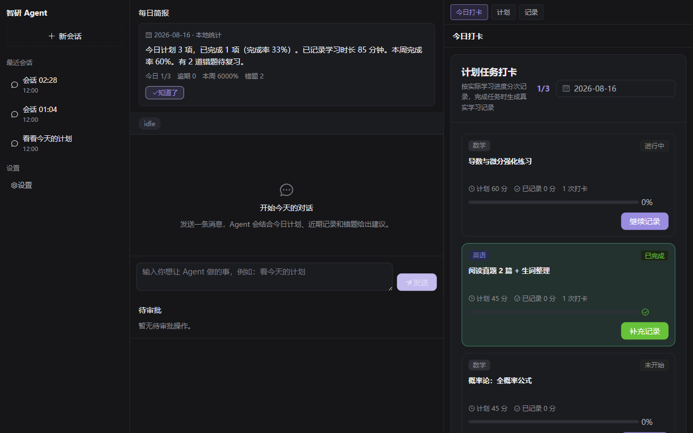
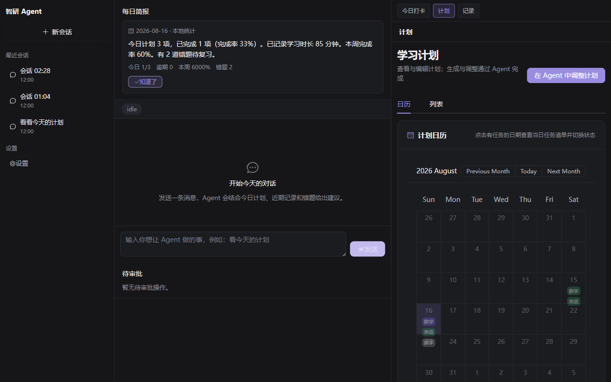
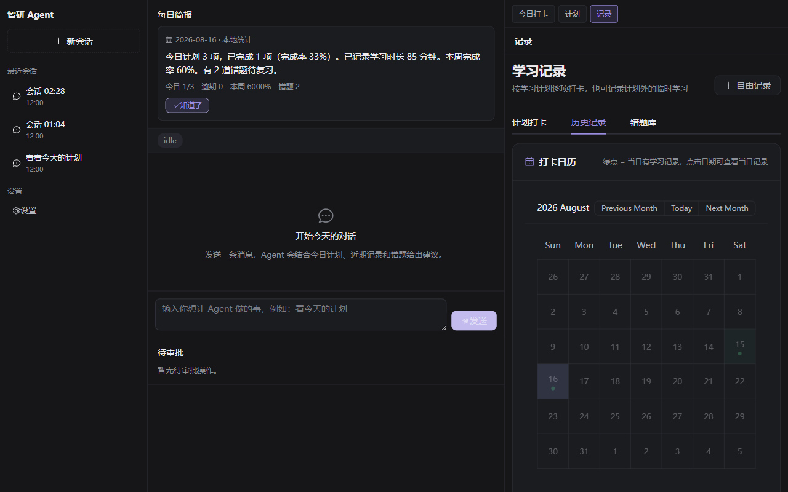
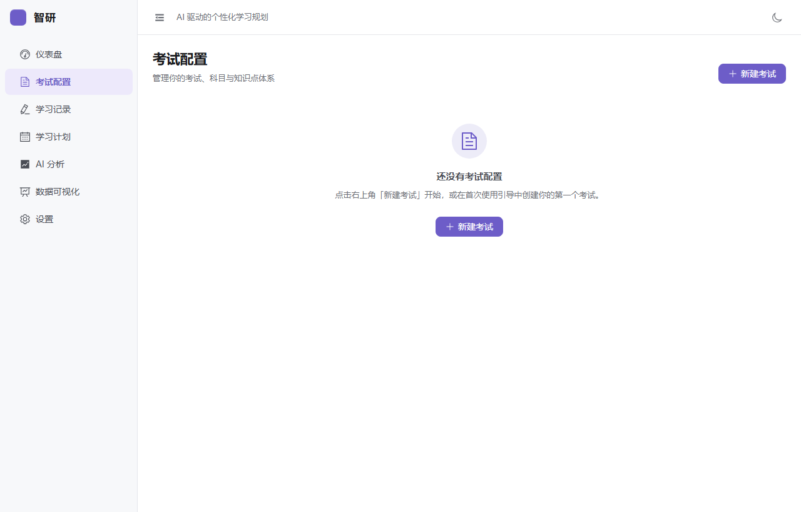
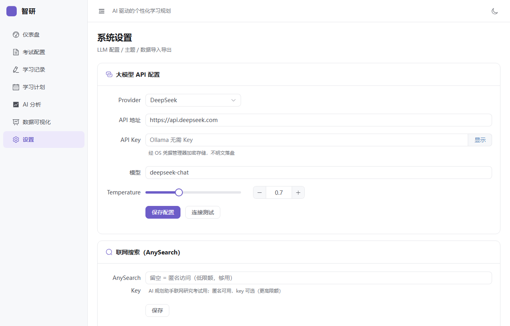
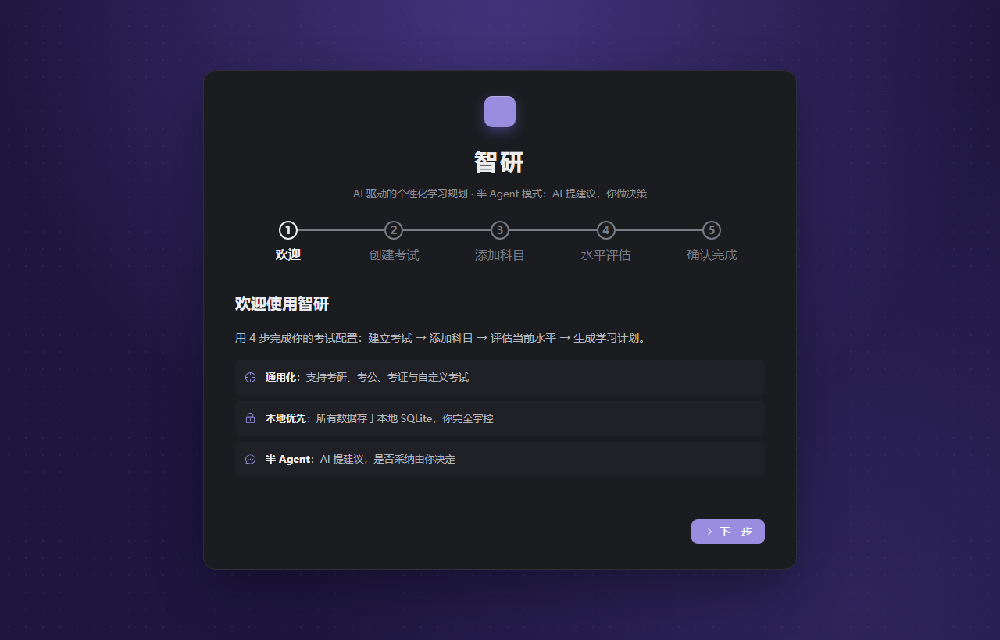
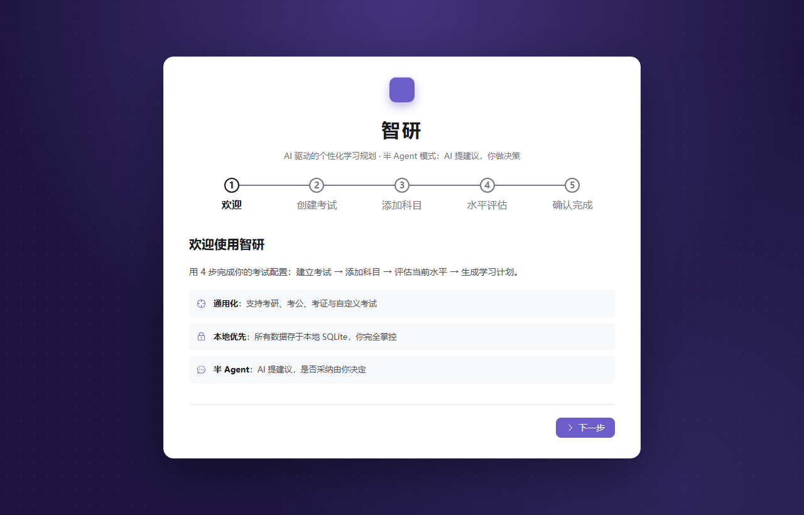

# 智研（ZhiYan）

> AI 驱动的个性化学习规划桌面应用 —— **纯 Agent 架构**：Agent 是唯一的 AI 入口，所有写操作经审批闭环，你始终掌握最终决策权。

<p align="center">
  <a href="./LICENSE"></a>
  <a href="https://github.com/Suxiao-yong/zhiyan/releases"></a>
  <a href="https://github.com/Suxiao-yong/zhiyan/actions"></a>
  
  
  
</p>

---

## 目录

- [这是什么](#这是什么)
- [界面预览](#界面预览)
- [设计理念：Agent 主权边界](#设计理念agent-主权边界)
- [架构总览](#架构总览)
- [Agent 工具协议](#agent-工具协议)
- [用户功能](#用户功能)
- [数据与存储](#数据与存储)
- [隐私与安全](#隐私与安全)
- [快速开始](#快速开始)
- [开发与测试](#开发与测试)
- [项目结构](#项目结构)
- [FAQ 与已知限制](#faq-与已知限制)
- [文档索引](#文档索引)
- [贡献与许可](#贡献与许可)

---

## 这是什么

智研是一个 Tauri 桌面应用，把"AI 学习助手"做成了一套**可审计、可撤回**的工程系统：

- **纯 Agent**：计划生成、计划调整、学习记录、错题、复盘——所有 AI 能力都收敛到 Agent 对话，通过 11 个注册工具与你的数据交互
- **半自主**：Agent 可以自由读取（R0），但**写操作必须经你确认**（R2 设置确认 / R3 审批卡），执行后还可整体撤销
- **本地优先**：学习数据只存本地 SQLite；LLM API Key 存 OS 凭据管理器；发送给云端的是你确认过的聚合摘要

一句话：**AI 是你的学习顾问，不是你的老板。**

## 界面预览

**Agent 对话工作台（主界面 `/agent`）**——会话侧栏、每日简报、对话中心与右栏工作台：

|             主界面（今日打卡工作台）             |
| :----------------------------------------------: |
|  |

|             计划工作台（日历视图）             |              记录工作台（打卡日历）              |
| :--------------------------------------------: | :----------------------------------------------: |
|  |  |

以下截图来自早期版本，仅作参考：

|                   引导·考试配置（暗色）                   |                     系统设置（亮色）                     |
| :-------------------------------------------------------: | :------------------------------------------------------: |
|  |  |

|                    引导页（暗色）                    |                    引导页（亮色）                     |
| :--------------------------------------------------: | :---------------------------------------------------: |
|  |  |

## 设计理念：Agent 主权边界

智研的核心不是"AI 有多强"，而是**AI 改变数据的能力边界有多清晰**。每个 Agent 工具在注册时声明五类元数据，运行时强制执行：

| 元数据             | 取值                                                        | 含义                                   |
| ------------------ | ----------------------------------------------------------- | -------------------------------------- |
| `risk`             | R0–R4                                                       | 风险分级，决定确认策略                 |
| `confirmation`     | automatic / summary_or_setting / required / navigation_only | 确认方式                               |
| `idempotency`      | retry_safe / required_exactly_once / no_automatic_retry     | 重试语义                               |
| `supports_undo`    | bool                                                        | 是否支持事务级撤销                     |
| `data_permissions` | 字符串列表                                                  | 访问的数据域（如 `study_plans:write`） |

策略落地：

| 级别   | 策略                         | 典型工具                                                                              |
| ------ | ---------------------------- | ------------------------------------------------------------------------------------- |
| **R0** | 只读，自动执行               | `plan.get_today`、`record.get_history`、`plan.preview_generate`                       |
| **R1** | 低风险写，自动 + 可撤销      | （当前未注册）                                                                        |
| **R2** | 写，需设置确认               | `plan.generate`                                                                       |
| **R3** | 写，审批卡确认后执行，可撤销 | `plan.apply_preview`、`record.checkin_plan`、`record.create_free`、`wrong_question.*` |
| **R4** | 仅导航                       | （策略边界，不注册工具）                                                              |

### 审批闭环（R3 写操作的完整生命周期）

```text
Agent 请求写操作
   │
   ▼
executor 校验 schema / 作用域 / 前置条件
   │
   ▼
生成脱敏预览（影响行数、日期范围、前后摘要、冲突）── 审批卡（10 分钟过期）
   │                                          │
   ▼                                          ▼
确认 ──► 重新校验（savepoint 事务）──► 落库 ──► 可撤销（事务补偿）
   ▲
拒绝/过期 ──► 零写入，Run 正常继续
```

- **per-approval 守卫**：同一审批重复点击只执行一次
- **exactly-once 幂等**：写工具以 SHA-256 输入指纹预留执行，并发竞争有界重试，重放返回胜者结果
- **undo 补偿**：`plan.apply_preview.v1` / `record.checkin_plan.v1` 定向补偿事务，恢复被替换的计划与记录关联；外部已修改时拒绝撤销

## 架构总览

```text
┌─────────────────────────────────────────────────────────────┐
│  Frontend (Vue 3 + TypeScript)                              │
│  AgentHome（对话/审批卡/简报） + 工作台（打卡/计划/记录）      │
│  Pages → Stores(Pinia) → Services → invoke()                │
├───────────────────────────────────┼─────────────────────────┤
│  Backend (Rust)                   ▼                         │
│  ┌───────────────────────────────────────────────────────┐  │
│  │  Agent 运行时（唯一 AI 入口）                          │  │
│  │  planner（模型↔工具循环, OpenAI-compatible reqwest）    │  │
│  │    → executor（事务/幂等/undo）                        │  │
│  │    → policy（R0–R4）→ tools（11 个注册工具）           │  │
│  │    → repository（会话/Run/Step/审批/审计持久化）        │  │
│  ├───────────────────────────────────────────────────────┤  │
│  │  本地确定性能力层                                      │  │
│  │  scheduler（提醒/逾期）· brief（每日简报）· tray        │  │
│  │  credentials（keyring）· db（迁移 v1–v10, WAL）        │  │
│  └───────────────────────────────────────────────────────┘  │
└─────────────────────────────────────────────────────────────┘
```

**Agent 是唯一 AI 入口**。历史上独立存在的 AI 分析、计划生成器、聊天助手、本地降级链路均已删除；前端 `analyzer.ts` 只保留确定性统计聚合，AI 文案全部来自 Agent 对话。每日简报与提醒为本地确定性能力，不依赖模型。

## Agent 工具协议

工具注册表（`agent/tools/`）内置 11 个工具，全部 Rust 原生执行，输入/输出均经 JSON Schema 校验：

| 工具                           | 风险 | 确认 | 撤销 | 幂等         | 能力                                         |
| ------------------------------ | ---- | ---- | ---- | ------------ | -------------------------------------------- |
| `exam.get_active`              | R0   | 自动 | —    | 重试安全     | 当前考试与科目                               |
| `plan.get_today`               | R0   | 自动 | —    | 重试安全     | 今日计划（04:00 业务日边界）                 |
| `plan.get_range`               | R0   | 自动 | —    | 重试安全     | 日期范围计划                                 |
| `plan.preview_generate`        | R0   | 自动 | —    | 重试安全     | 生成周计划草案（只读，不落库）               |
| `record.get_history`           | R0   | 自动 | —    | 重试安全     | 学习记录历史                                 |
| `plan.generate`                | R2   | 确认 | —    | exactly-once | 写入周计划（权重分配，每周幂等）             |
| `plan.apply_preview`           | R3   | 审批 | ✅   | 重试安全     | 应用草案，替换旧计划，可整体撤销             |
| `record.checkin_plan`          | R3   | 审批 | ✅   | exactly-once | 计划打卡（锁定计划字段、联动错题、聚合更新） |
| `record.create_free`           | R3   | 审批 | —    | 重试安全     | 自由记录                                     |
| `wrong_question.create`        | R3   | 审批 | —    | 重试安全     | 录入错题                                     |
| `wrong_question.mark_mastered` | R3   | 审批 | —    | 重试安全     | 标记掌握                                     |

协议层保障：

- **Schema 双校验**：输入（拒绝未知/锁定字段）与输出（落库前验证）双向把关
- **字节上限**：上下文快照、工具输出、累计 prompt、序列化请求体均有 UTF-8 字节上限
- **上下文审计**：每次模型调用记录 `agent_context_audit`（工具清单、数据类别、字段名、token），**不存原文**
- **稳定错误码**：命令边界返回脱敏、稳定的错误码（如 `provider_protocol_error`、`idempotency_conflict`）
- **能力探测**：连接测试会实测流式与工具调用能力，失败返回稳定错误码

## 用户功能

### 🤖 Agent 对话工作台（`/agent`，单一入口）

三栏布局：

- **会话侧栏**：多会话，历史可回看、继续
- **对话中心**：流式渲染模型回复与工具执行轨迹；写操作插入审批卡
- **右栏工作台**：今日打卡 / 学习计划 / 学习记录，切换不打断对话
- **每日简报**：本地聚合当天计划、完成情况、逾期、薄弱点

其他页面（计划、记录、设置）作为工作台与配置入口保留；旧路径（`/dashboard`、`/analysis`、`/visualization`）自动重定向到 `/agent`。

### 💬 典型用法示例

主界面就是对话框，直接说你的目标：

| 你说的话                            | Agent 做的事                                                         | 你会看到                               |
| ----------------------------------- | -------------------------------------------------------------------- | -------------------------------------- |
| "帮我看今天的计划"                  | `plan.get_today`（R0 只读）                                          | 今日任务列表直接回复                   |
| "为我的数学制定本周计划"            | `plan.preview_generate` 生成周草案（R0）→ `plan.apply_preview`（R3） | 审批卡展示草案预览 → 确认落库 → 可撤销 |
| "昨晚做了 30 道题错 5 道，帮我记录" | `record.checkin_plan` / `record.create_free`（R3）                   | 审批卡确认后写入记录与错题             |
| "这道错题我掌握了"                  | `wrong_question.mark_mastered`（R3）                                 | 审批卡确认后标记                       |
| "对比我这周和上周的学习情况"        | `plan.get_range` + `record.get_history`（R0）                        | 数据驱动的摘要回复（复盘）             |

右栏工作台与对话联动：打卡、改计划、看历史的同时，对话上下文不丢。

### 📅 学习计划

- **Agent 生成**：对话中发起 → `plan.preview_generate` 生成周草案（只读）→ 审批卡预览 → `plan.apply_preview` 落库 → 可整体撤销
- **日历视图**：月历概览；**列表视图**：拖拽排序
- **计划 vs 实际**：由学习记录实时派生，对比统计内嵌展示

### 📝 学习记录与错题

- **计划打卡**：`record.checkin_plan`（R3）锁定计划字段，多次打卡自动累计实际时长，联动写入错题，同步计划聚合
- **自由记录**：`record.create_free`（R3），支持补记
- **跨天归一化**：凌晨 04:00 前的实时记录归属前一天（业务"今日"一致）
- **错题库**：`wrong_question.create` / `mark_mastered`（R3），支持复习计数与掌握标记

### 🔔 本地提醒与托盘

- `task_reminder`（默认 19:00，尊重 `reminder_time` 设置）与 `overdue_check`（09:00）由 Rust 调度器 60s tick 驱动，原子领取、日期级去重、失败重试
- 尊重通知开关与托盘暂停状态
- 每日简报为按需读取（`mode=local`），不再作为后台 job 调度

### 📦 数据管理

- JSON 导出（全量 / 指定考试 / 日期范围）与导入（跳过 / 覆盖 / 合并，schema 校验 + 分批写入）
- 数据库备份（`VACUUM INTO` 一致性快照）与恢复（覆盖 + 自动重启）

## 数据与存储

SQLite 单文件（WAL 模式，外键强制），17 张表：

### 业务数据

| 表                                        | 说明                                                    |
| ----------------------------------------- | ------------------------------------------------------- |
| `exams` / `subjects` / `knowledge_points` | 考试 / 科目 / 树形知识点（掌握度）                      |
| `study_plans`                             | 每日计划（pending / in_progress / completed / skipped） |
| `study_records`                           | 学习记录（打卡与自由记录，`plan_id` 关联）              |
| `wrong_questions`                         | 错题（复习计数 / 掌握标记）                             |
| `ai_analyses`                             | 历史分析表（只读弃用，保留兼容）                        |

### Agent 运行时

| 表                              | 说明                                       |
| ------------------------------- | ------------------------------------------ |
| `agent_sessions` / `agent_runs` | 会话与 Run（状态机含中断恢复）             |
| `agent_steps` / `agent_events`  | 工具执行步骤（收据 / undo 载荷）与审计事件 |
| `agent_approvals`               | 审批（过期时间、前置条件 hash、决定状态）  |
| `agent_context_audit`           | 模型调用数据溯源（不含原文）               |
| `agent_memories`                | 长期记忆（保留表，新代码不读）             |
| `agent_jobs` / `agent_messages` | 后台调度 / 会话消息                        |

数据库迁移 v1–v10 **forward-only**（测试强制无 DROP / RENAME / DELETE），升级自动执行，操作手册见 `docs/agent/migration-runbook.md`。

## 隐私与安全

| 数据        | 存储位置                                                               | 加密      |
| ----------- | ---------------------------------------------------------------------- | --------- |
| 学习数据    | 本地 SQLite                                                            | —         |
| LLM API Key | OS 凭据管理器（Windows DPAPI / macOS Keychain / Linux Secret Service） | ✅ 系统级 |
| 非敏感配置  | SQLite settings 表                                                     | —         |

- API Key 只在保存瞬间从输入框一次性提交给 Rust（`store_api_key`），前端**从不读取**已保存的 Key（只有 `has_api_key` 布尔）
- 发送给云端前必须确认**数据出境范围**（provider / 地址 / 模型任一变化需重新确认）
- 发送内容是聚合摘要（考试信息、当日计划、近期记录摘要、错题摘要），且有上下文审计留痕
- 命令错误与事件 payload 固定脱敏（不暴露 SQL、路径、密钥、原文）

## 快速开始

### 环境要求（Windows 为主要支持平台）

- Node.js ≥ 18
- Rust 工具链（`stable-x86_64-pc-windows-msvc`，经 [rustup](https://rustup.rs/)）
- Visual Studio C++ Build Tools（勾选"使用 C++ 的桌面开发"）
- WebView2 Runtime（Windows 11 自带）

### 从源码运行

```bash
git clone https://github.com/Suxiao-yong/zhiyan.git
cd zhiyan
npm install
npm run tauri dev        # 开发模式（热重载）
npm run tauri build      # 生产构建（产物在 src-tauri/target/release/bundle/）
```

预编译安装包见 [Releases](https://github.com/Suxiao-yong/zhiyan/releases)（`.msi` 安装包 / `.exe` 便携版）。

### 三步上手

1. **引导**：创建考试 → 添加科目 → 知识点掌握度自评
2. **设置**（可选但推荐）：配置 OpenAI 兼容 provider（DeepSeek / OpenAI / 通义千问 / Kimi / 自定义），填入 API Key，确认数据出境范围，连接测试
3. **对话**：在 `/agent` 发送"为我的数学制定本周计划"，预览并确认审批卡

> 💡 不配置 LLM：数据查看、编辑、打卡、提醒全部可用，仅 Agent 对话不可用。也支持配置本地 Ollama，但本地模型暂不支持 Agent 工具调用。

## 开发与测试

```bash
# 前端：单元测试（13 文件 / 79 用例）、类型、代码风格
npx vitest run
npx vue-tsc --noEmit
npx eslint .
npx prettier --check "src/**/*.{ts,vue}"

# Rust：全部测试（lib 165 + agent_repository 12 + agent_tools 42）
cargo test --manifest-path src-tauri/Cargo.toml --all-targets

# Rust 质量门
cargo clippy --manifest-path src-tauri/Cargo.toml --lib -- -D warnings
cargo fmt --manifest-path src-tauri/Cargo.toml -- --check
```

测试重点：

- **前端**：路由单一入口契约、Agent 客户端 DTO、密钥边界、导入导出、打卡 UI
- **Rust lib**：Run 状态机与中断恢复、R0–R4 策略、执行器事务编排、调度器、迁移链
- **集成**：exactly-once 并发竞态、undo 补偿链、审批过期 / 重复确认、迁移升级恢复、隐私脱敏

## 项目结构

```text
zhiyan/
├── src/                        # 前端（Vue 3 + TS）
│   ├── components/
│   │   ├── agent/              # 对话侧栏 / 审批卡 / 简报 / 工作台宿主
│   │   └── plan/ record/ exam/ viz/ common/ layout/
│   ├── pages/                  # AgentHome（主界面）、StudyPlan、StudyRecord、Settings…
│   ├── services/               # db / record / plan / exam / analyzer / viz / export / agent-client
│   ├── stores/                 # Pinia：agent / exam / plan / record / settings
│   ├── router/                 # 单一入口：/ → /agent，旧路径重定向
│   └── types/  assets/
├── src-tauri/                  # Rust 后端
│   ├── src/
│   │   ├── agent/              # planner / executor / policy / runtime / repository /
│   │   │                       #   tools / context_snapshot / plan_draft / context / error
│   │   ├── scheduler.rs  brief.rs  tray.rs  credentials.rs  db.rs  lib.rs
│   ├── tests/                  # 集成测试（agent_tools / agent_repository）
│   └── capabilities/           # Tauri 权限声明
├── docs/                       # 设计概念 / 截图 / 迁移与 parity 文档
├── tests/fixtures/             # 测试 fixture
└── package.json  vite.config.ts  tsconfig.json  vitest.config.ts
```

## FAQ 与已知限制

### 常见问题

**Q：为什么 Agent 不可用/提示未连接？**
未配置 LLM，或配置后未在设置页**确认数据出境范围**。provider / API 地址 / 模型任一变化后都需重新确认。

**Q：保存后 API Key 在设置页不显示？**
这是设计使然：Key 只经 OS 凭据管理器加密存储，前端永不回读，页面只显示"已配置/需要重新输入"布尔状态。

**Q：有本地离线模式吗？**
学习数据的录入、查看、打卡、提醒均不依赖模型；Agent 对话需要云端 LLM。不再提供"本地算法生成计划"的降级方案。

**Q：提醒时间为什么不受设置影响？**
提醒时间键已统一为 `reminder_time`（默认 19:00 生效），设置页的提醒时间 UI 尚未接入，当前请通过托盘暂停/恢复控制提醒。

**Q：切换 Provider 后提示"需要 API Key"？**
切换后 keyring 状态会即时刷新；新 Provider 若未配置过 Key，需重新输入保存。

### 已知限制

- ollama：可作为 provider 配置，但**本地模型暂不支持 Agent 工具调用**
- 平台：仅在 Windows 上完整测试；macOS / Linux 构建依赖 Tauri 官方环境，未验证
- 长期记忆（`agent_memories`）：表保留兼容，新代码不再自动读取
- 手工测试清单（打包手测等）见 [MANUAL_TEST.md](MANUAL_TEST.md)

## 文档索引

| 文档                                                                                       | 说明                   |
| ------------------------------------------------------------------------------------------ | ---------------------- |
| [docs/agent/migration-runbook.md](docs/agent/migration-runbook.md)                         | 数据库迁移操作手册     |
| [docs/agent/feature-parity.md](docs/agent/feature-parity.md)                               | 功能 parity 矩阵       |
| [docs/agent/cloud-llm-cutover-migration.md](docs/agent/cloud-llm-cutover-migration.md)     | Cloud LLM 改造迁移说明 |
| [docs/agent/cloud-llm-cutover-test-matrix.md](docs/agent/cloud-llm-cutover-test-matrix.md) | 改造测试矩阵           |
| [docs/agent/cloud-llm-cutover-baseline.md](docs/agent/cloud-llm-cutover-baseline.md)       | 改造验证基线           |
| [docs/design-concepts/](docs/design-concepts/)                                             | 产品设计概念稿         |
| [MANUAL_TEST.md](MANUAL_TEST.md)                                                           | 手动测试清单           |
| [PROJECT_STATUS.md](PROJECT_STATUS.md)                                                     | 项目进度状态           |
| [CHANGELOG.md](CHANGELOG.md)                                                               | 变更日志               |

## 贡献与许可

欢迎提交 Issue 和 Pull Request！请参阅 [CONTRIBUTING.md](./CONTRIBUTING.md) 与 [CODE_OF_CONDUCT.md](./CODE_OF_CONDUCT.md)。

本项目基于 [Apache License 2.0](./LICENSE) 开源。Copyright 2026 ZhiYan Contributors。
